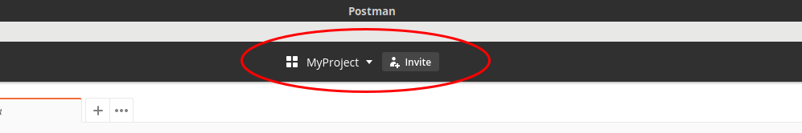
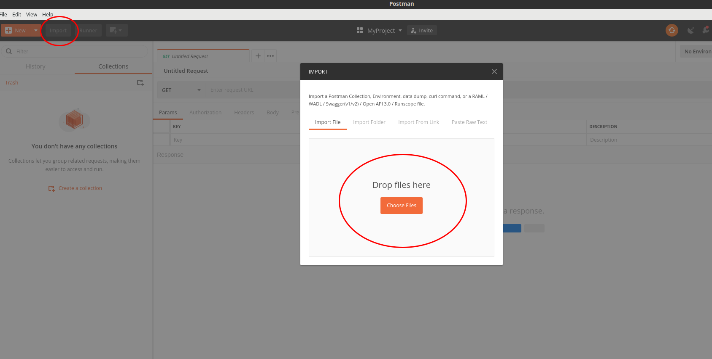
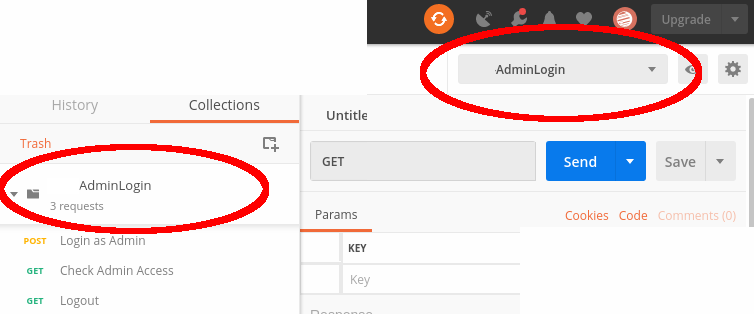
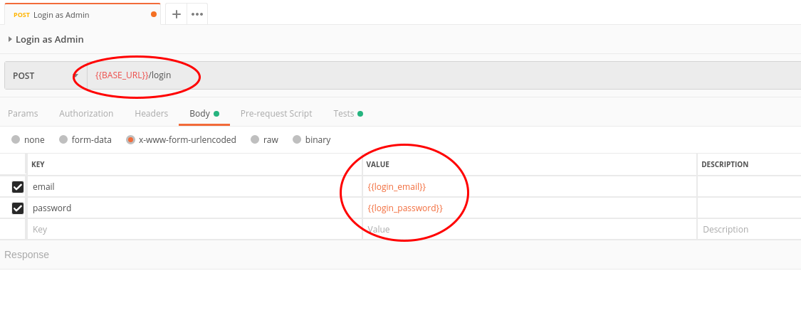
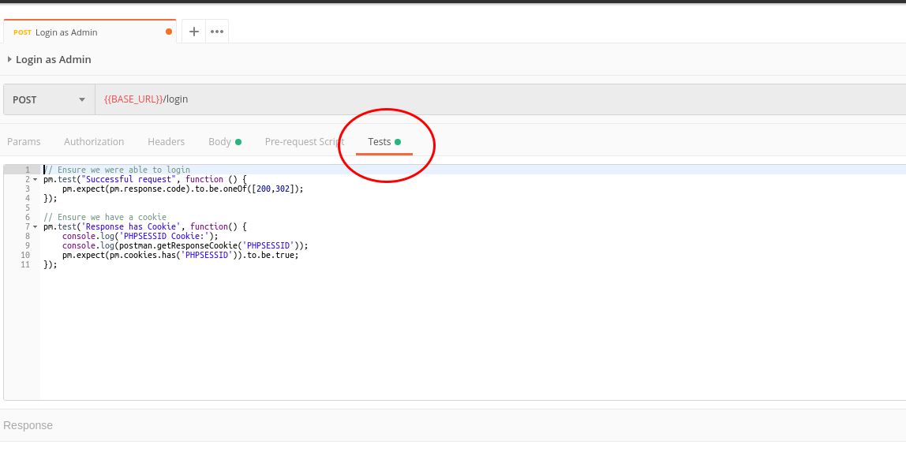
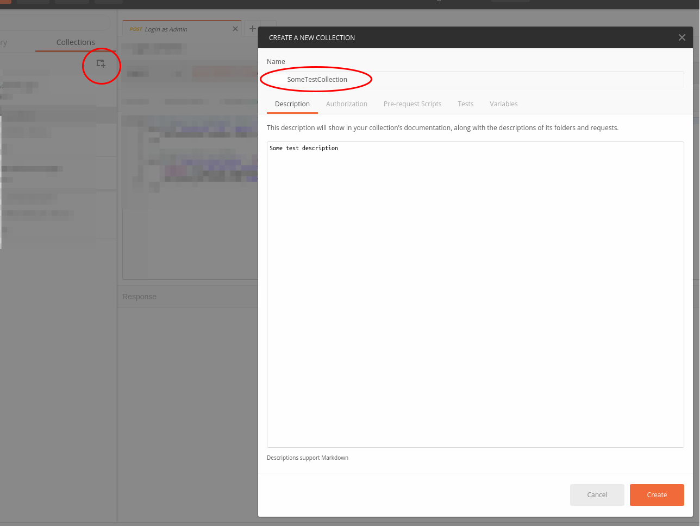
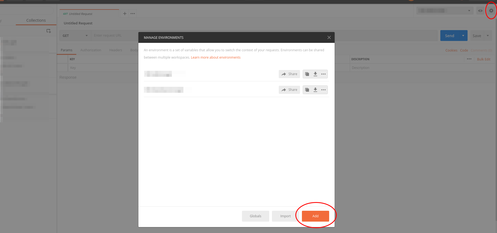
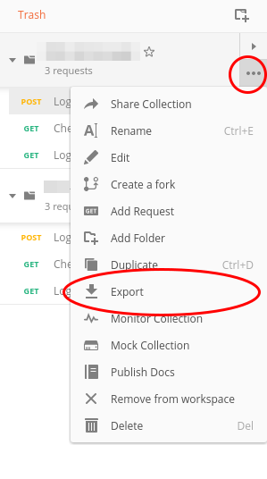
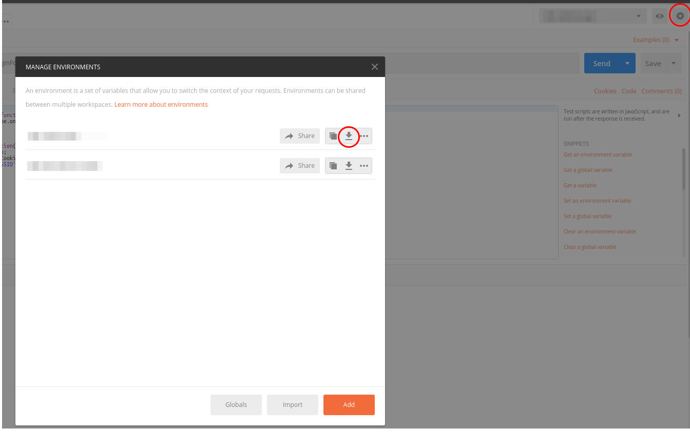

----------------------------------------------------------------------

# Using Postman

## Setup Postman

First install Postman from [here](https://www.getpostman.com/).

#### Setup Project Workspace
Open Postman and start by creating a new Personal Workspace by clicking the drop-down at the top of the screen.

#### Import Workspace Global variables
Once this is setup, import the global variables by clicking the __"Import"__ button in the top left corner.
Under the __"Import File"__ tab, you can either browse to the globals file or drag it into the box.
You need to import the file - __'[ROOT]/tests/newman/project_globals_config.postman_globals.json'__

## Importing an existing collection of tests

Editing a "collection" involves importing the collection into postman along with the associated 
environment if it exists.
This is done in the same way as descried above for importing workspace globals.

Click the __"Import"__ button in the top left corner.
Under the __"Import File"__ tab, you can either browse to the collection file or drag it into the box.
At this point also import any associated environment files.

> __Note:__ When editing a collection, ensure you have the same environment selected while sending 
> the requests.
>
> 

## Some rules for formatting your request

A collection will have one or more requests, these are displayed on the left-hand side.

When formatting your requests, it is best to set values as variables and then apply them to the 
request by calling the variable inside '{{VARIABLE_NAME}}'.

It is also important to set the base url as a the global variable '{{BASE_URL}}'. Using these 
variables allows us to modify the request dynamically when executed with newman so it is relevant to 
the environment that it is executed against.

## Adding tests to a collection's request

The collection tests are edited in the __"Tests"__ tab. These tests are written in javascript.

For more detailed information on how to do this, take a look at the Postman docs on [writing test scripts](https://learning.getpostman.com/docs/postman/scripts/intro_to_scripts)

## Creating a new collection of tests

To create a new test in Postman, click the __"New Collection"__ button.

Collection names must __NOT__ have any spaces or special characters. The name of the collection will 
be exported to the collection file's name.

In the below image example the collection is named "SomeTestCollection". This will later be 
exported to:
__"[ROOT]/tests/newman/tests/[NEWMAN_GROUP]/SomeTestCollection.postman_collection.json"__

## Creating a new environment for a collection

To add a new collection environment, click the __"Manage Environments"__ button (has a cog icon) in 
the top right of the screen. Then click the orange __"Add"__ button.

Environments need to be named the same as the collection for which they are created.
For example, the above collection was named "SomeTestCollection". Then an associated environment 
will also be called "SomeTestCollection".
When the environment is exported, it will share a common name with the collection. In this way they 
are linked during execution with the `nt-run` script.

## Exporting a collection

To export a collection, lick the three dots on the collection, then click __"Export"__

Collection files are exported to a "test group" folder.
__"[ROOT]/tests/newman/tests/[NEWMAN_GROUP]/SomeTestCollection.postman_collection.json"__

## Exporting an environment

To export a collection environment, click the __"Manage Environments"__ button (has a cog icon) in 
the top right of the screen.
Each environment has a download button. Click the relevant environment's download button and save it 
to the same folder as it's collection. Eg:
__"[ROOT]/tests/newman/tests/[NEWMAN_GROUP]/SomeTestCollection.postman_environment.json"__

